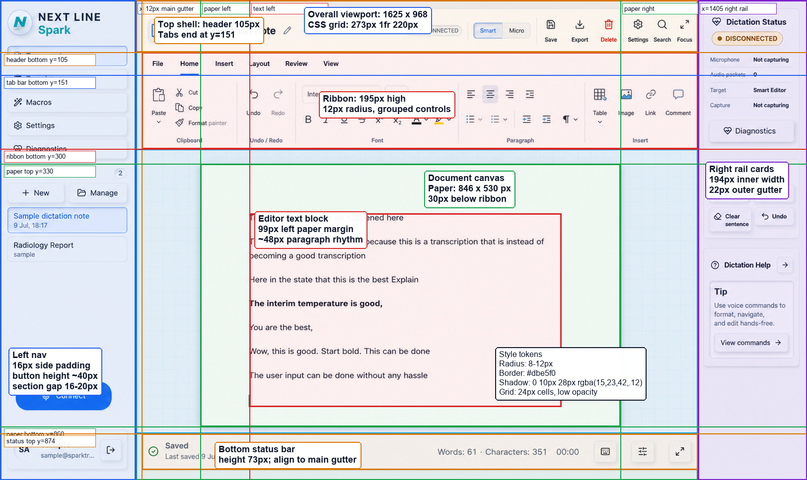

# Dictation Workspace UI Measurements

Reference image:



Use this document with the annotated image when planning or implementing the
dictation workspace UI. Measurements are taken from the provided 1625 x 968
reference screenshot and should be treated as target proportions, not a mandate
to hardcode every pixel at every viewport size.

## Layout Targets

- Viewport reference: `1625 x 968`.
- App shell grid: `273px 1fr 220px`.
- Left navigation width: `273px`.
- Main workspace width at reference size: `1132px`.
- Right rail width: `220px`.
- Main content gutter from left nav: `12px`.
- Header area: `105px` tall.
- Tab bar bottom: `151px`.
- Ribbon area: `195px` tall, from `y=105` to `y=300`.
- Editor grid area: from `y=300` to `y=874`.
- Bottom status bar: `73px` tall, from `y=874` to `y=947`.

## Document Canvas

- Paper bounds in reference screenshot: `846 x 530px`.
- Paper position: `x=403`, `y=330`.
- Paper top offset from ribbon bottom: `30px`.
- Text block starts at `x=502`, about `99px` from the paper left edge.
- Paragraph rhythm is approximately `48px` between paragraph baselines.
- Keep the document surface visually dominant, centered in the main workspace,
  and separated from the grid background by a soft shadow.

## Component Sizing

- Left nav horizontal padding: `16px`.
- Left nav item height: about `40px`.
- Left nav section gap: `16-20px`.
- Right rail outer gutter: about `22px`.
- Right rail card inner width: about `194px`.
- Ribbon card corner radius: `12px`.
- Buttons and small cards should use `8-12px` radius.
- Toolbar groups should be visually segmented with subtle vertical dividers.

## Visual Tokens

- App background: very light blue-gray, close to `#f5f9fd`.
- Border color: close to `#dbe5f0`.
- Primary action blue: close to `#1769f6`.
- Text color: close to `#0f172a`.
- Muted text: close to `#475569`.
- Paper shadow: `0 10px 28px rgba(15, 23, 42, 0.12)`.
- Card shadow: subtle, lower opacity than the paper shadow.
- Editor grid: `24px` cells with very low opacity blue-gray lines.

## Responsive Guidance

- Preserve the three-column desktop shell when width allows.
- On narrower screens, collapse the right rail before shrinking the document
  below a usable editing width.
- Keep the paper centered in the main workspace with stable gutters.
- Avoid text overlap by giving toolbar controls fixed heights and wrapping or
  hiding labels only at defined breakpoints.
- Use stable dimensions for icon buttons, toolbar groups, status items, and
  document chrome so hover states do not shift layout.

## Codex Handoff Prompt

Use this prompt when asking Codex to plan or implement the UI:

```text
Implement the dictation workspace UI to match docs/ui-reference/dictation-workspace-measurements.png and docs/ui-reference/dictation-workspace-ui-measurements.md.

Plan first. Use the existing React/Vite app structure and existing component patterns. Preserve behavior unless explicitly changing UI layout. Focus on the shell grid, header/ribbon proportions, editor canvas, right rail, left nav, spacing, borders, shadows, and responsive behavior. Do not introduce new dependencies unless existing icons/components are insufficient. Validate with a local build and a visual browser check if possible.
```
